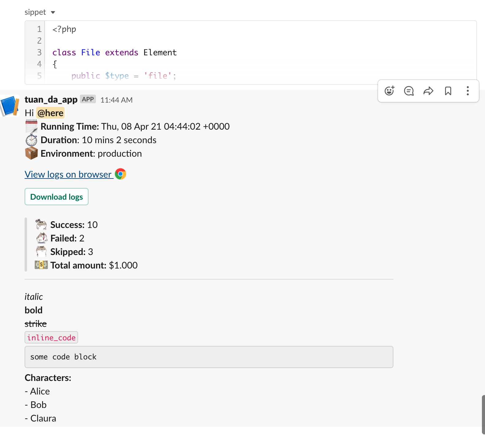

# README

A simple slack client. Thanks, Slack team work hard for a simple and clear API document.
Also, we have a few libraries help us work with Slack API more comfortable.

However, I couldn't enjoy with these things sometime. A partway in my self need something more.
I need a library to know every single field that I can send to Slack, but requires a minimal setup also.
That why I decide create a library by myself. Try to make clean, meaningful API.
Hope you will enjoy with it.

YEP. In this time, It is not perfect. 

But believe me, It will be better more and more.

## Example

```php
<?php

use Slack\Block;
use Slack\Message;
use Slack\Client;
use Slack\Markdown;
use Slack\Block\Section;
use Slack\Block\Actions;
use Slack\Block\Button;
use Illuminate\Support\Carbon;
use Slack\File;

$channel = '#your-channel-name';
// $channel = 'your-channel-name';
// $channel = 'CHANNEL_ID';

$client = new Client('your-client-id');

$message = new Message;
$message->channel = $channel;

$snipet = <<<SNIPPET
<?php

class File extends Element
{
    public \$type = 'file';

    public \$external_id;

    public \$source;

    public \$block_id;

    public function __construct(string \$external_id, string \$source, string \$block_id = null)
    {
        \$this->external_id = \$external_id;
        \$this->source = \$source;
        \$this->block_id = \$block_id;
    }
}
SNIPPET;

$report = File::content($snipet);
// File::fromPath('/some/file/path')
$report->channels = $channel;

// OPTIONAL: set a name for report file
$report->filename = 'sippet';
$report->filetype = 'php';

$lines = [
    'Hi '. Markdown::here(),
    sprintf(':spiral_calendar_pad: *Running Time:* %s', Carbon::now()->format(Carbon::RFC822)),
    ':stopwatch: *Duration*: 10 mins 2 seconds',
    ':package: *Environment*: production'
];

$blocks[] = Section::markdown(Markdown::multiLines($lines));

if ($file = $client->uploadFile($report)) {
    $blocks[] = Section::markdown(
        Markdown::link($file->url_private, 'View logs on browser :google-chrome:')
    );
    $blocks[] = Actions::actions(
        Button::primary('Download logs', $file->url_private_download)
    );
}

$blocks[] = Section::markdown(
    Markdown::multiLines([
        Markdown::quote(':ami-ok: *Success:* 10'),
        Markdown::quote(':ami-what3: *Failed:* 2'),
        Markdown::quote(':ami-what2: *Skipped:* 3'),
        Markdown::quote(':dollar: *Total amount:* $1.000'),
    ])
);

$blocks[] = Block::divider();

$blocks[] = Section::markdown(
    Markdown::multiLines([
        Markdown::italic('italic'),
        Markdown::bold('bold'),
        Markdown::strike('strike'),
        Markdown::inlineCode('inline_code'),
        Markdown::codeBlock('some code block'),
        Markdown::bold('Characters: '),
        Markdown::lists([
            'Alice',
            'Bob',
            'Claura'
        ]),
    ])
);

$message->blocks($blocks);

$client->postMessage($message);
```

### Result

